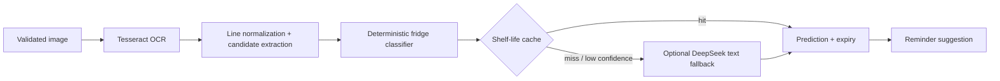

# Calendar App 核心算法说明

> 更新日期：2026-08-10
> 目标：解释当前实现的输入、规则、边界和验证位置，不把 AI 输出描述为确定性事实。

## 1. 循环事件展开

**实现**：`src/domain/logic/recurrence.ts`
**输入**：master Event、RecurrenceRule、当前 view range。

- Daily：从 base start 按 `interval` 天递增。
- Weekly/Custom：以周一为周起点，逐日扫描；仅保留 `daysOfWeek` 命中且 week delta 可被 interval 整除的日期。
- Monthly：按目标日生成；目标月没有该日时 clamp 到当月最后一天。
- Count 终止按已生成次数判断；Date 终止不生成 `until` 之后实例。
- 保留原事件时长；实例 ID 为 `masterId_yyyy-MM-dd`。
- `deletedOccurrences` 在展示层过滤单次删除；编辑 this/following/all 由 store 维护 exception 或系列切分。

**边界**：range end 早于 start 返回空；算法不物化无限实例，只展开当前视图范围。
**测试**：`Office/test/unit/domain/recurrence*.test.ts`、`Office/test/integration/recurringEvents.test.tsx`。

## 2. 事件相等、去重和重叠

**实现**：`eventDeduplication.ts`、`eventUtils.ts`。

事件草稿 identity 由以下字段拼接：

1. trim + lowercase title；
2. 标准化 ISO start/end；
3. all-day/timed；
4. 标准化 event type，缺省为 general。

批量应用时先建立 existing event key map，再用 `seenKeys` 阻止同一批重复；结果区分 `existing-event` 与 `same-batch`。重叠判断使用半开区间：`left.start < right.end && right.start < left.end`，首尾相接不算冲突。

**边界**：标题相同但时间或类型不同不算重复；identity 不做自然语言语义去重。
**测试**：`eventDeduplication.test.ts`、AI integration 的 overlap blocking 场景。

## 3. Todo 优先级与空档排程

**实现**：`src/domain/logic/taskPlanner.ts`。

候选过滤：排除 `done` 或已有 `linkedEventId` 的 Todo。排序稳定规则：

1. priority：high > medium > low；
2. due date：更早优先，无 due date 排最后；
3. energyNeeded：high > medium > low；
4. createdAt：更早优先。

空档搜索按天执行：

- 默认窗口 09:00–17:00，可由 caller 覆盖。
- 合并现有 Event 与本轮已排任务并按开始时间排序。
- 从当天窗口起点向后推进；在 busy block 前能容纳 `etaMinutes` 就返回。
- 当天尾部也无法容纳则进入下一天。
- 找不到空档时产生 warning，不写 Event。

**复杂度**：每个 Todo 会对范围内日期与 busy blocks 扫描；适合个人日历规模，不是大规模资源排程器。
**测试**：`taskPlanner.test.ts`、`todoPanel.test.tsx`、`localAIService.test.ts`。

## 4. 日历网格和时间上下文

**实现**：`dateHelpers.ts`、`timeContext.ts`。

- 月视图按周一开始扩展为完整周网格。
- 周/日范围由 focused date 计算；格式化与比较统一经过 date-fns。
- AI 上下文同时携带 browser current time、IANA timezone、UTC offset、locale 和 focused calendar date。
- `timezoneOverride` 存在时，用指定 IANA timezone 生成可读当前时间，但不把 focused date 当作真实“今天”。

**边界**：DST 与本地格式由 `Intl`/date-fns 负责；无效 override 应在配置 schema 或服务端校验阶段失败。
**测试**：`dateHelpers.test.ts`、`timeContext.test.ts`、AI current/focused date integration。

## 5. 项目进度

**实现**：`src/domain/logic/progress.ts`。

- 有 Actions 时，以 Action 状态为唯一来源。
- 没有 Actions 但有 Milestones 时，退化到 Milestone 状态。
- `skipped` 不进入分母；`done` 进入完成数。
- 百分比为 `round(completed / total * 100)`；无可计数项为 0。

该算法表达结构完成度，不等于目标效果或指标达成度。Dashboard 会把它与 metrics、capacity、Check-in 分开显示。

## 6. AI 结构化输出与审批

**实现**：`ai.schema.ts`、`apiAIService.ts`、`localAIService.ts`、`useAI.ts`、`ApprovalDrawer`。

1. 前端构造最小必要上下文和 operation type。
2. 后端选择 routine/planning model，并执行预算/模式 clamp。
3. Provider 输出先去除协议包装，再解析 JSON。
4. Zod 对 discriminated action union、时间、字段长度和结果形状做 fail-closed 校验。
5. Near-term action 添加人工确认 warning；duplicate/overlap 标记阻塞。
6. 结果只进入 pending state；用户批准后逐条调用 store。

Local provider 是有限确定性回退：可解析明确时间和常见动作，不声称拥有完整自然语言推理能力。无效 provider 响应、HTML、截断 JSON、schema mismatch、hard budget 均不会直接修改数据。

## 7. Active Tool 意图匹配与路线

**实现**：`toolTemplateMetadata.ts`、`enabledTools.ts`、`activeToolPrompt.ts`。

- 模板匹配使用受控中英文关键词/字段抽取，不调用未知代码。
- 已存在、active 且 routing-enabled 的 tool 优先于再次建议模板。
- 元数据正规化 `implementationPath`、alias、templateId、route flag 和版本字段。
- 缺少推荐字段允许继续，但生成 accuracy warning；必填字段缺失则阻止激活。
- 运行结果保存为 ToolRun；产生日历草稿时仍需预览/批准。

## 8. Goal Control 容量、触发和版本

**实现**：`backend/goal_control.py`、`goal_control_api.py`。

### 容量

- Actions 按 Minimum / Standard / Stretch 分层。
- Standard + Minimum 不得超过扣除 buffer 后的周容量；默认 buffer 为 20%。
- Effort entries 保存 planned/actual，用于容量偏差而不是覆盖原计划。

### 触发

Medium sensitivity 的确定性规则关注：连续 off-track、里程碑延迟、重复容量超支、leading/lagging metric 漂移和连续遗漏 Minimum action。低置信度、异常或安全边界仅要求确认。

### 版本与提案

- 激活计划产生首个 version。
- 手工编辑在五分钟窗口内合并，避免每个字段生成一个版本。
- AI 修改产生 proposal diff；resolve 时只应用用户选择的项目。
- Rollback 创建新版本并保留证据，不覆盖历史记录。

### AI 用量

模式解析优先级：goal override → user default → server default → administrator maximum clamp。月度计数按用户时区确定月份；hard limit 阻止模型调用，但不阻止 Check-in、图表、手工编辑和本地数据。

**测试**：`test_goal_control.py`、`test_auth_api.py`、Goal Planner/AI integration。

## 9. OCR、商品识别与保质期

**实现**：`backend/fridge/*`。

- 上传先验证文件名、MIME、magic header 和大小，避免把任意内容交给 OCR。
- OCR confidence 综合可见字符、行和噪声；低于阈值且文本足够时可请求 DeepSeek。
- Parser 去除空行、价格/总计等噪声；classifier 用食品类别规则判断是否冷藏。
- Cache 按 exact、normalized、defaults、runtime 分层；runtime 写入使用临时文件 + replace。
- 到期日 = purchase date + shelf-life days；response confidence 聚合 OCR 与结果置信度。

**边界**：估算不代替食品安全判断；低置信度必须展示来源和 warning。
**测试**：`test_fridge_pipeline.py`、`fridgeApiService.test.ts`、`fridgePanel.test.tsx`。

## 10. 桌面数据库迁移

**实现**：`backend/desktop_migration.py`。

1. 从 SQLite URL 得到绝对路径并取得进程间 migration lock。
2. 对原库执行 SQLite online backup，保留 checksum。
3. 从快照复制独立 candidate。
4. 识别已知旧布局和 false-0007 stamp；仅对已知情况修正 revision。
5. 对 candidate 运行 Alembic head。
6. 验证 `integrity_check`、foreign keys、schema fingerprint、revision 和业务记录数。
7. 全部通过后原子替换原库；任何异常保留原库和诊断并返回 `recovery_required`。

未知 schema 不会自动猜测或 stamp。

## 11. 更新前备份保留

**实现**：`backend/update_backup.py`。

- 对版本字段做路径安全清洗，禁止目录穿越。
- 使用 SQLite backup 创建一致快照并计算 SHA-256。
- checksum 与备份同目录保存。
- 按时间排序，只保留最近三组备份；清理失败不会让未校验快照替代原库。

**测试**：`test_update_backup.py`、desktop stability E2E。

## 12. 多用户完整性与导入冲突

- Repository 的所有个人读写都绑定认证 `user_id`。
- 复合外键阻止跨 owner 的 goal/project/action/event 关系。
- 导入 preview 生成 checksum；执行时重验以防 preview 后数据变化。
- newer `updatedAt` 胜出；同时间不同内容要求显式冲突选择。
- Integrity audit 可报告、隔离和归档修复 orphan/raw JSON，但不静默吞掉问题。

**验证边界**：SQLite 默认套件验证逻辑与关系；只有真实 MySQL contract 验证 MySQL 方言、约束和并发行为。
