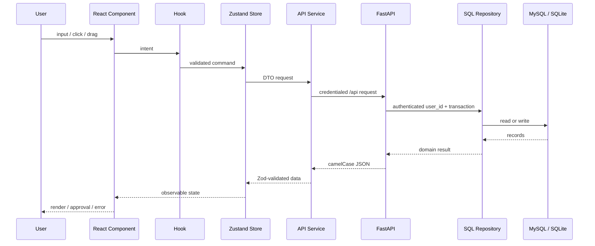

# Calendar App 输入、处理与输出数据流

> 基准：2026-08-10 当前代码
> 本文描述生产主链路；旧 localStorage/Firestore adapter 仅用于兼容测试。

## 1. 通用请求链

共同边界：

- Server 使用 session cookie 与 CSRF；Desktop 使用只存在于 Tauri 启动握手中的 loopback token。
- 后端从认证上下文取得 `user_id`，不接受客户端指定数据所有者。
- 前端和后端均校验输入；SQL transaction 是多记录写入的最终原子边界。
- 401 会触发会话失效与用户态 store 清理，避免旧账号数据留在界面。

## 2. 启动、bootstrap 与登录

**输入**：运行模式、数据库 URL、桌面 data dir/令牌或服务端 cookie。

**处理**：

1. 桌面壳启动 sidecar，读取随机端口和一次性令牌；Web 版直接使用同 origin `/api`。
2. 前端调用 `/api/bootstrap`。
3. 后端返回 `mode`、`authRequired`、能力、用户与偏好。
4. Server 未登录时只显示登录页面；账号只能由 `python -m backend.manage_users` 创建。
5. Desktop 验证启动令牌后返回本地主体，无注册和登录交互。
6. 认证成功后并行加载事件、Todo、Event Type、Memory、Tool Preset 和 Fridge inventory。

**输出**：已认证工作区、登录页或带诊断的启动恢复页。

**失败边界**：错误数据库方言、无效令牌、sidecar 超时、数据库需要恢复、会话过期均 fail closed。

## 3. 日历事件 CRUD 与循环实例

**输入**：标题、开始/结束时间、全天标记、类型、循环规则或拖放目标。

**处理**：

1. `EventForm`/拖放 hook 生成 Event draft。
2. Zod 校验时间范围和字段形状。
3. Store 通过 `ApiCalendarStorageAdapter` 调用 `/api/calendar/events`。
4. 后端仓储在当前 `user_id` 下写入事件。
5. 读取视图时，前端在选定范围内展开 daily/weekly/custom/monthly 循环实例。
6. “仅本次”以 exception/deleted occurrence 表达；“本次及以后”切分系列；“全部”更新 master。

**输出**：月/周/日视图中的排序事件卡，或明确的校验/冲突错误。

**真实场景**：创建会议、修改重复锻炼、本周拖动某个实例而不改变历史实例。

## 4. Todo 创建与确定性排程

**输入**：Todo 标题、状态、类型、截止日期、`etaMinutes`、priority、energyNeeded 和可排时间范围。

**处理**：

1. Todo 作为日历前的任务事实保存，不强迫立即生成 Event。
2. 本地排程器过滤已完成或已链接任务，按优先级、截止时间、能量、创建时间排序。
3. 在默认 09:00–17:00 或调用方指定窗口中，按天扫描现有事件和已分配任务之间的首个可容纳空档。
4. 用户确认 `schedule_todo` 动作后创建 Event，并双向写入 `todo.linkedEventId` / event link。

**输出**：可审阅的排程动作、无法放入范围的 warning、已链接日历事件。

**边界**：确定性排程不预测通勤、休息偏好或隐含资源；这些需要用户或 AI 提供额外约束。

## 5. AI 对话、动作计划与审批

**输入**：自然语言目标/命令、当前日期时间、时区、日历焦点、事件、Todo、Event Type、Active Tools 和 AI usage mode。

**处理**：

1. `useAI` 构造明确区分“真实当前时间”和“日历焦点日期”的上下文。
2. API provider 通过后端 `/api/ai/chat/completions` 代理；密钥不进入浏览器 bundle。
3. 无 API key 或选择 local 时，`LocalAIService` 提供确定性有限能力。
4. 返回内容必须通过 `AIBreakdownResultSchema`、`AICalendarActionPlanSchema` 等 Zod schema。
5. 近期时间需确认；重叠或重复事件会阻塞直接应用。
6. AI 结果进入 `ApprovalDrawer`；只有用户确认后才调用事件/Todo store。

**输出**：对话消息、可编辑动作卡、warning、批准后写入的 Event/Todo，或不改变数据的拒绝结果。

**失败边界**：无效 JSON、错误 schema、HTML/截断响应、预算 hard limit、超时和上游错误不会直接写业务数据。

## 6. 长期目标、Goal Control 与 Active Tools

**输入**：目标陈述、当前情况、指标、里程碑、行动、容量、Check-in 回答和 AI 使用偏好。

**处理**：

1. Goal Conversation 每轮提出 1–3 个可回答问题，先锚定当前情况，再形成可测量预览。
2. 激活时在一个 transaction 中创建 Goal、Project、Metric、Milestone、Action、依赖、控制策略、Check-in schedule 和首个版本。
3. 手工结构修改立即保存，并在编辑窗口内合并版本；AI 修改保存为 `PlanChangeProposal`。
4. 用户可接受全部/部分或拒绝提案；未接受内容不改变项目结构。
5. Dashboard 聚合容量、行动状态、指标趋势、关键路径、版本和 Check-in。
6. Active Tool 元数据存放 alias、template、routing flag、implementationPath；AI 只路由到启用且允许 routing 的实例。

**输出**：可回滚的计划版本、待审提案、进度、Check-in、日历草稿和工具运行历史。

**边界**：低置信度、异常或安全边界只请求确认/建议暂停，不自动重排或自动暂停。

## 7. 冰箱票据与库存

**输入**：JPG/JPEG/PNG/WebP 票据、purchase date、timezone、是否生成提醒建议。

**处理**：

1. 后端验证扩展名、MIME、magic header 和大小。
2. Tesseract 本地 OCR 生成文本与置信度。
3. 规则 parser 清理行、去价格/噪声并提取候选商品；classifier 过滤非冷藏品。
4. Shelf-life cache 按 exact/normalized/default 匹配。
5. OCR 或规则结果不足时，且配置允许，才调用 DeepSeek 文本降级。
6. 预测结果计算到期日、总体置信度和 reminder suggestions。
7. 用户选择后才把商品写入当前账号库存或把提醒应用到日历。

**输出**：结构化 OCR、候选、保质期、到期日、trace、recoverable errors、warnings。

**边界**：上传图片只在请求期间处理；默认 text-only DeepSeek 不承诺图像原生识别；付费 AI 不在自动测试中调用。

## 8. 数据导出、预览与导入

**输入**：当前账号导出请求，或带版本、校验和、冲突策略的备份文件。

**处理**：

1. `/api/data/export` 仅导出当前账号的可移植业务数据；密钥和 AI usage events 不进入备份 v2。
2. `/api/data/import/preview` 解析并校验，不写数据库；返回新增、更新、跳过和冲突。
3. newer `updatedAt` 默认胜出；同时间不同内容要求明确选择 local/backup。
4. 执行导入时重验 preview checksum；当前数据已变化则返回 409。
5. Replace 仅在桌面已有 SQLite snapshot 或服务端已下载账号备份时开放。

**输出**：下载文件、预览报告、原子导入统计或可重试冲突。

**边界**：导入不能跨用户引用对象；关系错误在写入/恢复校验阶段被拒绝或隔离。

## 9. 桌面更新与安全迁移

**输入**：应用版本、分发类型、更新 manifest、SQLite 路径。

**处理**：

1. 安装版检查 GitHub updater；portable 版只提示并打开发布页。
2. 安装前调用 `/api/data/pre-update-backup` 创建 SQLite online backup 与 SHA-256。
3. 仅保留最近三份 pre-update backup。
4. 数据库升级对独立 candidate 执行 Alembic，验证后原子替换；失败保留原库、快照和诊断。
5. 更新安装必须由用户确认。

**输出**：更新提示、进度、可恢复备份或明确的 migration recovery 状态。

## 10. 可观测性与不进入生产数据的内容

- `/api/health` 和 `/api/bootstrap` 提供运行模式和最小健康信息。
- E2E 失败的 trace、截图、日志保存在忽略目录 `test-results/` / `playwright-report/`。
- Sidecar 运行日志保存在用户数据目录，stdout 只用于启动协议。
- `.env.local`、签名密钥、Credential Manager 密钥、`.secrets/`、测试数据库和构建产物不得签入 Git。
