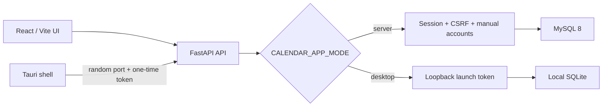

# Calendar App 技术架构

> 当前事实基准：`codex/calendar-0.2.0-stabilization` / `019148d` 及本次整理工作区
> 更新日期：2026-08-10
> 维护者：Codex / Calendar App 团队

## 1. 系统定位

Calendar App 是一个共享前端、双运行时的数据与目标管理应用：

- **服务端版**：React 前端与 FastAPI API 部署在同一 HTTPS origin；MySQL 8 是唯一业务数据源。账号由运营人员通过 CLI 创建，不提供公开注册。
- **桌面版**：Tauri 启动 PyInstaller 打包的 FastAPI sidecar；SQLite 保存在用户本机；用户无需登录。桌面版和服务端版不自动同步，只通过带版本的数据备份导入导出迁移。

两个版本使用同一份 `src/` 和 `backend/` 代码，通过运行时模式、数据库 URL、启动令牌和打包入口分流，而不是维护两个代码分支。

## 2. 代码组织与职责

| 区域           |     规模（当前工作区） | 职责                                            |
| -------------- | ---------------------: | ----------------------------------------------- |
| `src/`         | 183 文件 / 约 25.6k 行 | React UI、领域模型、状态、服务适配器            |
| `backend/`     |   48 文件 / 约 9.4k 行 | FastAPI、认证、SQL 仓储、目标控制、OCR、迁移    |
| `src-tauri/`   |    Rust 入口及桌面资源 | Sidecar 生命周期、启动握手、更新、通知、安装包  |
| `scripts/`     |                13 文件 | OpenAPI、E2E、MySQL、版本和桌面构建             |
| `Office/test/` |     76 个测试/支持文件 | Vitest、Python unittest、Playwright 和公共 mock |
| `openapi/`     |           1 个签入快照 | API 路由与 DTO 的机器可比对契约                 |

`node_modules/`、`dist/`、`build/`、`src-tauri/target/`、本地密钥及运行数据库不属于源码审计范围。

## 3. 前端五层架构

ESLint 的 `import/no-restricted-paths` 规则执行依赖方向，避免 UI、状态和 I/O 相互穿透。

1. **Domain (`src/domain`)**
   - Zod schema 是事件、Todo、配置、AI 动作、工具会话等前端数据形状的校验入口。
   - `logic/` 保存循环展开、排程、去重、时间上下文、进度、工具路由等确定性算法。
   - 不依赖 React、Zustand 或后端传输实现。
2. **Services (`src/services`)**
   - `appApiClient` 统一 base URL、cookie credentials、CSRF、401 会话失效处理和请求中止。
   - 日历、Todo、Event Type、Memory、Goal Control、Fridge、备份和更新均通过 API client/adapter 访问。
   - `localStorageAdapter`、`firestoreAdapter` 仅保留为兼容/迁移测试，不是生产启动主链路。
3. **Stores (`src/store`)**
   - Zustand stores 按认证、事件、Todo、配置、AI、目标、冰箱、更新和 UI 拆分。
   - Store 负责可观察状态、乐观更新、错误状态和调用 service；退出登录或会话过期时由 `resetUserSessionStores` 清除用户态数据。
4. **Hooks (`src/hooks`)**
   - 把 Store 与 React 生命周期组合，处理异步加载、拖放、AI 审批、Check-in、Active Tool 和工作区视图模型。
5. **Components (`src/components`)**
   - 展示和用户交互层，只从 hooks、domain types 和通用 UI 组件取数据。
   - `ApprovalDrawer` 是 AI 生成动作写入日历或计划前的人工确认边界。

### 前端启动与认证

`src/main.tsx` 的启动顺序为：

1. 如果在 Tauri 内运行，读取桌面 runtime 信息并配置随机 sidecar 地址和启动令牌。
2. 注册 401 处理器、用户数据清理函数和会话恢复函数。
3. 为日历、Todo、Event Type、Memory、Tool Preset 配置 API-backed service。
4. 调用 `/api/bootstrap` 获取运行模式、能力、当前用户和偏好。
5. 服务端未登录时显示 `LoginPage`；桌面模式获得本地主体并直接进入应用。
6. 登录/恢复成功后并行刷新事件、类型、Todo、目标、工具、冰箱等用户视图。

## 4. FastAPI 与数据库

`backend.server.create_app()` 是统一应用工厂。它解析 `CALENDAR_APP_MODE` 和数据库配置、建立 `AppState`，然后装配认证、请求大小限制、CORS、日历、目标控制、冰箱、AI、备份和配置路由。

### 运行模式约束

| 约束        | Server                         | Desktop                                |
| ----------- | ------------------------------ | -------------------------------------- |
| 数据库      | 必须是 `mysql+pymysql`         | 必须是本地 SQLite                      |
| 身份        | 运营人员手工创建的账号         | 固定本地主体，无登录页                 |
| 请求认证    | HttpOnly session cookie + CSRF | Tauri 启动令牌                         |
| Schema 管理 | 运维停止写入后显式 Alembic     | 启动时安全候选迁移                     |
| AI 配置     | 管理员控制模型/预算上限        | 用户本地配置和 Credential Manager 密钥 |
| 数据同步    | 账号范围内共享                 | 仅本机；通过备份迁移                   |

### API 与数据模型

当前 OpenAPI 快照包含 **83 个业务路由**，主要路由族为：

- `/api/auth/*`、`/api/bootstrap`、`/api/health`
- `/api/calendar/events|todos|event-types|import`
- `/api/memory/*`、`/api/goal-conversations/*`
- `/api/check-ins/*`、`/api/metrics/*`、`/api/plan-*`
- `/api/fridge/*`、`/api/tool-presets/*`
- `/api/ai/chat/completions`、`/api/me/ai-usage`
- `/api/data/export|import|pre-update-backup`、`/api/config`

`backend/database.py` 定义 **31 个 SQLAlchemy record**，覆盖用户/会话、事件/Todo、目标/项目/里程碑/行动、指标/Check-in、计划版本/依赖/提案、工具运行、冰箱、AI 用量、审计隔离和修复记录。

所有个人业务记录必须携带 `user_id`。数据库复合约束、仓储查询和备份导入校验共同防止同一业务 ID 在不同账号间串联。Alembic 当前 head 为 `20260719_0008`。

## 5. 桌面运行时

`src-tauri/src/lib.rs` 负责：

1. 选择安装版或 portable 数据目录。
2. 启动 `calendar-backend` sidecar，让后端预绑定随机 `127.0.0.1` 端口。
3. 从 stdout 读取一次 `CALENDAR_BACKEND_READY` 握手；令牌不进入命令行、环境变量或日志。
4. 在 15 秒内完成握手和健康确认，否则显示可恢复启动错误。
5. 向前端暴露 base URL、版本、分发类型和令牌。
6. 应用退出时终止 sidecar；安装版负责更新检查，portable 版只打开下载页。

桌面迁移不直接改写原 SQLite。系统先加锁、创建快照和 migration candidate，运行 Alembic 后验证完整性、外键、schema fingerprint、revision 和记录数，全部通过后才原子替换。

## 6. 技术栈

| 层         | 技术                                                               |
| ---------- | ------------------------------------------------------------------ |
| UI         | React 18、TypeScript 5、Vite 6、Tailwind/PostCSS                   |
| 状态与校验 | Zustand 5、Zod 3、date-fns 4                                       |
| 交互       | dnd-kit、Tauri notification/opener/process/updater                 |
| API        | FastAPI、Uvicorn、HTTPX                                            |
| 数据       | SQLAlchemy 2、Alembic、PyMySQL、MySQL 8、SQLite                    |
| 安全       | Argon2、HttpOnly session、CSRF、请求大小限制、登录节流             |
| AI/OCR     | DeepSeek-compatible chat completions、Tesseract、本地规则/缓存降级 |
| 桌面       | Tauri 2、Rust、PyInstaller、NSIS、portable ZIP                     |
| 测试       | Vitest/RTL/MSW、Python unittest、Playwright、真实 MySQL contract   |
| CI 基准    | Node 24、Python 3.14、Rust 1.97、MySQL 8                           |

依赖安装以 `package-lock.json`、`requirements-server.lock`、`requirements-desktop.lock` 和 `src-tauri/Cargo.lock` 为准。

## 7. 构建、发布与契约

- `npm run build`：TypeScript project build + Vite production bundle。
- `npm run openapi:check`：临时 SQLite 应用与签入 OpenAPI 快照逐对象比较。
- `npm run rust:check`：检查 Tauri Rust 代码。
- `npm run desktop:build`：准备隔离 Python 环境、sidecar、Tesseract、许可证、NSIS 和 portable 包。
- `.github/workflows/validate.yml`：格式、lint、Vitest、构建、OpenAPI、Python、Rust、桌面 E2E、MySQL contract、服务端 E2E 和依赖审计。
- `.github/workflows/release-desktop.yml`：复用质量门禁后构建签名更新和草稿 Release。

## 8. 文档事实来源

优先级从高到低：

1. 当前源码、配置、迁移和 OpenAPI 快照。
2. 本文、`Office/docs/input-output-flow.md`、`Office/docs/algorithms.md`。
3. `Office/test/` 的说明和当前验证状态。
4. `Office/architecture.json` 与 `Office/architecture/`：Golden Goose 在父提交 `0122bc` 上生成的 `partial` 历史快照，仅用于静态证据追溯，不代表当前完整架构。

旧 ADR 中关于 Firebase 主同步链路或未来 Node 后端的描述属于历史决策背景；当前生产事实以 FastAPI + SQL 双运行时为准。
